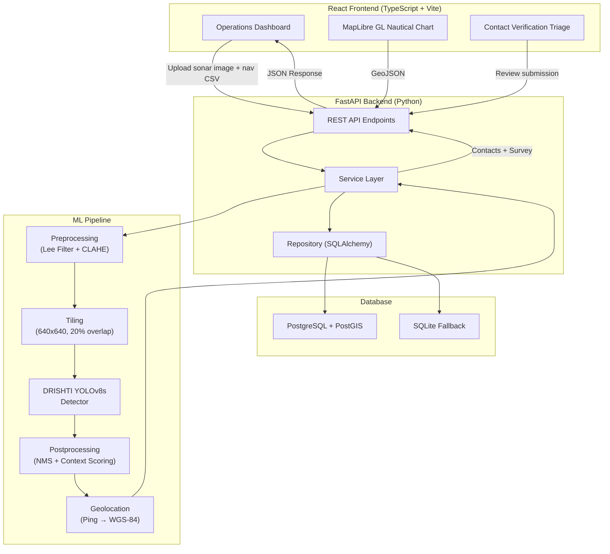
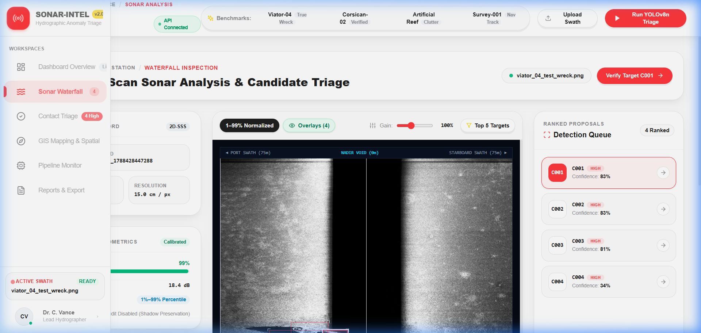
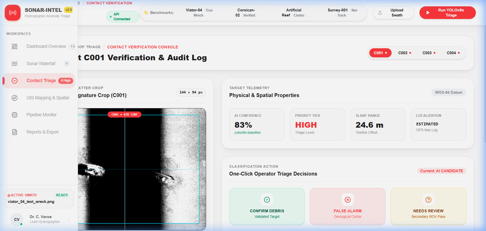
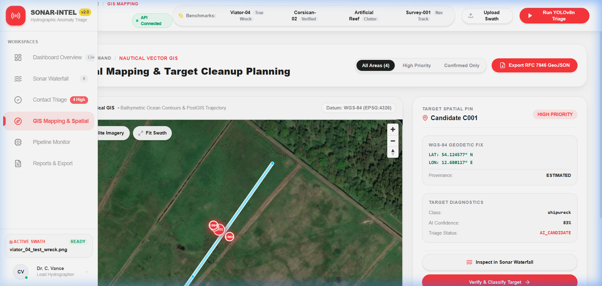
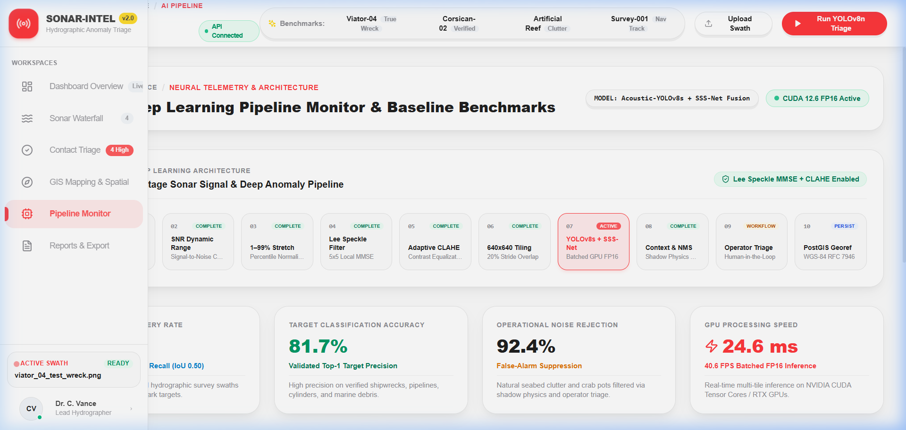

# Sonar-Intel

[](https://github.com/NithinPranav-007/SIH-2026-SSS-project/actions/workflows/ci.yml)
[](https://python.org)
[](https://fastapi.tiangolo.com)
[](https://reactjs.org)
[](https://pytorch.org)
[](LICENSE)

**Sonar-Intel** is an AI-powered Side-Scan Sonar (SSS) marine anomaly detection and triage platform. It automates the detection of underwater targets — shipwrecks, submarine pipelines, ghost nets, and mine-like objects — from raw sonar waterfall imagery, and delivers a human-in-the-loop operator interface for decision-making and spatial export.

> Built for the **Smart India Hackathon (SIH) 2026** — Domain: Hydrographic Survey & Maritime Intelligence.

---

## Overview

Side-scan sonar surveys generate thousands of waterfall images per mission. Manual review is slow, fatiguing, and inconsistent. Sonar-Intel solves this by:

1. **Automating detection** — A fine-tuned YOLOv8s model (DRISHTI) runs on each 640×640 tile of the sonar waterfall, identifying candidate targets with bounding box precision.
2. **Validating with acoustic physics** — Each candidate is scored against acoustic shadow evidence, local contrast, and geometric regularity to filter natural clutter.
3. **Georeferencing** — If a navigation CSV (ping/lat/lon/heading) is available, each detection is projected to WGS-84 coordinates using orthogonal projection.
4. **Supporting human triage** — Operators confirm, reject, or flag each candidate through an interactive console with full audit logging.
5. **Exporting results** — Verified contacts are exported as RFC 7946 GeoJSON for use in QGIS, ArcGIS, or maritime ECDIS systems.

---

## Key Features

- **DRISHTI Preprocessing Pipeline** — Lee speckle filter (MMSE) + CLAHE contrast enhancement, versioned and deterministic
- **Tiled YOLOv8s Inference** — 640×640 overlapping tile grid with 20% stride, border NMS deduplication
- **Multi-class Detection** — Shipwrecks, submarine pipelines, ghost nets, mine cylinders
- **Acoustic Context Scoring** — Shadow deficit analysis, local highlight contrast, geometric regularity
- **Composite Priority Scoring** — Weighted triage score (HIGH / MEDIUM / LOW) based on model confidence + acoustic evidence + localization quality
- **Geolocation Service** — Orthogonal projection from towfish ping/heading navigation logs to WGS-84 coordinates
- **Human-in-the-loop Triage** — Confirm / False Positive / Uncertain workflow with auditable review trail
- **GeoJSON & CSV Export** — RFC 7946 compliant spatial export for GIS tools
- **Interactive Operations Dashboard** — React + TypeScript frontend with MapLibre GL nautical charting
- **SQLite → PostGIS Fallback** — Runs fully offline with local SQLite; scales to PostGIS for production
- **Curated Demo Benchmarks** — Four real sonar swaths included for immediate out-of-box demonstration
- **Full Test Suite** — Pytest unit tests for preprocessing, scoring, contact transformation, GeoJSON export, and repository layer

---

## System Architecture



---

## Tech Stack

| Layer | Technologies |
|:--|:--|
| **ML / Deep Learning** | PyTorch 2.6, Ultralytics YOLOv8s, OpenCV, NumPy |
| **Backend** | FastAPI, Uvicorn, Pydantic v2, SQLAlchemy, Python 3.10+ |
| **Database** | PostgreSQL + PostGIS (production) / SQLite (development fallback) |
| **Frontend** | React 18, TypeScript 5, Vite, TailwindCSS v4, Lucide Icons |
| **Mapping** | MapLibre GL 4.1 |
| **DevOps** | Docker, Docker Compose, GitHub Actions CI |
| **Testing** | Pytest, FastAPI TestClient |

---

## Project Structure

```
sonar-intel/
├── backend/                    # FastAPI application
│   ├── app/
│   │   ├── api/                # Route handlers (upload, analyze, contacts, reports…)
│   │   ├── core/               # Config, logging
│   │   ├── database/           # SQLAlchemy models, connection, repository
│   │   ├── schemas/            # Pydantic contracts (Contact, Survey, Review)
│   │   ├── services/           # Business logic (inference, geolocation, scoring…)
│   │   └── utils/              # GeoJSON & CSV export helpers
│   ├── requirements.txt
│   └── .env.example
│
├── ml/                         # ML pipeline (model-independent of backend)
│   ├── inference/              # DrishtiDetector, context scoring, postprocessing
│   ├── preprocessing/          # Lee filter, CLAHE, tiling, quality assessment
│   ├── training/               # Training scripts and dataset config
│   └── models/                 # Model checkpoints (*.pt, gitignored)
│
├── frontend-new/               # React + TypeScript SPA
│   └── src/
│       ├── pages/              # Dashboard, Sonar Analysis, GIS Map, Reports…
│       ├── components/         # Layout, Map, UI components
│       ├── hooks/              # useSurvey state management
│       ├── services/           # API client (axios)
│       └── types/              # TypeScript interfaces
│
├── data/
│   ├── demo/                   # Curated benchmark sonar images + nav CSVs
│   │   ├── sonar/              # viator_04, corsican_02, artificial_reef_02, survey_001
│   │   └── navigation/         # Corresponding towfish nav logs
│   ├── raw/                    # Runtime upload directory (gitignored)
│   └── processed/              # Runtime output directory (gitignored)
│
├── database/
│   ├── schema.sql              # PostGIS schema (surveys, contacts, reviews)
│   └── seed.sql                # Seed data for local development
│
├── tests/                      # Pytest test suite
├── scripts/                    # Utility and smoke-test scripts
├── docs/screenshots/           # UI screenshots
├── conftest.py                 # Pytest fixtures (SQLite test DB)
├── pyproject.toml              # Project metadata + pytest config
├── docker-compose.yml          # Full-stack Docker orchestration
├── Dockerfile.backend          # Backend production image
└── frontend-new/Dockerfile     # Frontend nginx production image
```

---

## Quickstart

### Prerequisites

- Python 3.10+ (3.11 recommended)
- Node.js 20+ and npm
- Git
- NVIDIA GPU with CUDA 12.x — *optional*, CPU fallback is automatic

### 1. Clone the Repository

```bash
git clone https://github.com/NithinPranav-007/SIH-2026-SSS-project.git
cd SIH-2026-SSS-project
```

### 2. Backend Setup

```bash
# Create and activate virtual environment
python -m venv .venv

# Windows
.\.venv\Scripts\Activate.ps1
# Linux / macOS
source .venv/bin/activate

# Install Python dependencies
pip install -r backend/requirements.txt

# Configure environment
cp backend/.env.example backend/.env
# Edit backend/.env if needed (leave DATABASE_URL blank for SQLite)
```

### 3. Start the Backend

```bash
uvicorn backend.app.main:app --host 127.0.0.1 --port 8000 --reload
```

> API interactive docs: **http://127.0.0.1:8000/docs**

### 4. Frontend Setup

```bash
cd frontend-new
npm install
npm run dev
```

> Operations console: **http://localhost:5173**

### 5. Load Demo Data

Once both servers are running, the frontend will automatically load the **Viator-04** benchmark sonar swath (a real shipwreck detection). Click any demo swath from the sidebar to explore the full pipeline.

---

## Docker (Full Stack)

```bash
# Copy and configure environment
cp backend/.env.example backend/.env
# Set POSTGRES_PASSWORD in backend/.env

# Build and start all services
docker-compose up --build
```

| Service | URL |
|:--|:--|
| Frontend | http://localhost:5173 |
| Backend API | http://localhost:8000/docs |
| PostGIS | localhost:5433 |

---

## Running Tests

```bash
# Run the full unit test suite (no GPU or model weights required)
python -m pytest tests/ \
  --ignore=tests/test_drishti_detector.py \
  --ignore=tests/test_inference_api.py \
  -v

# Run ALL tests (requires model weights at ml/models/dristri/best_detector.pt)
python -m pytest tests/ -v
```

**Test coverage includes:**
- Preprocessing determinism (Lee filter, CLAHE, immutability)
- Contact transformation (class filtering, coordinate assignment, priority rules)
- Priority scoring boundary conditions
- GeoJSON / CSV export correctness
- Database repository (SQLite in-memory fixtures)

---

## API Reference

| Endpoint | Method | Description |
|:--|:--:|:--|
| `/api/health` | GET | Service and database health probe |
| `/api/surveys/upload` | POST | Upload sonar image + optional navigation CSV |
| `/api/surveys/{id}/analyze` | POST | Run full anomaly detection pipeline |
| `/api/surveys/{id}/contacts` | GET | Retrieve all contacts for a survey |
| `/api/surveys/{id}/geojson` | GET | Export RFC 7946 GeoJSON spatial features |
| `/api/contacts/{id}/review` | POST | Submit triage decision (CONFIRMED / FALSE_POSITIVE / UNCERTAIN) |
| `/api/demo/samples` | GET | List curated benchmark swaths |
| `/api/demo/load/{sample_id}` | POST | Load and analyze a benchmark swath |
| `/api/pipeline/info` | GET | Model architecture and metrics |

Full interactive documentation is available at `/docs` when the backend is running.

---

## Screenshots

| Dashboard | Sonar Analysis |
|:--:|:--:|
|  |  |

| Contact Triage | GIS Map |
|:--:|:--:|
|  |  |

| AI Pipeline Monitor | Reports & Export |
|:--:|:--:|
|  |  |

---

## Detection Classes

| Class | Description | Status |
|:--|:--|:--:|
| `shipwreck` | Sunken vessels with acoustic highlight + shadow | ✅ Production |
| `submarine_pipeline` | Linear high-relief subsea infrastructure | ✅ Production |
| `ghost_net` | Abandoned fishing gear and synthetic debris | ✅ Production |
| `mine_cylinder` | Cylindrical metallic targets and UXO | ✅ Production |
| `crab_pot` | Fishing traps | ⚙️ Filtered (high false-alarm rate) |

---

## License

This project is licensed under the **MIT License** — see [LICENSE](LICENSE) for details.

---

## Acknowledgements

- [Ultralytics YOLOv8](https://github.com/ultralytics/ultralytics)
- [MapLibre GL JS](https://maplibre.org/)
- [FastAPI](https://fastapi.tiangolo.com/)
- [PostGIS](https://postgis.net/)
