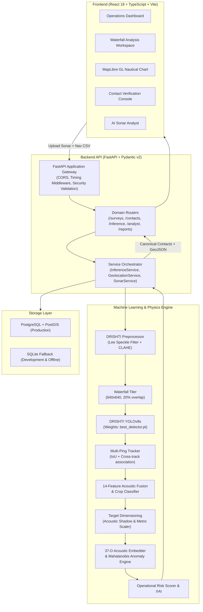

# Sonar-Intel

[](https://github.com/NithinPranav-007/SIH-2026-SSS-project/actions/workflows/ci.yml)
[](https://python.org)
[](https://fastapi.tiangolo.com)
[](https://reactjs.org)
[](https://pytorch.org)
[](https://github.com/ultralytics/ultralytics)
[](LICENSE)

**Sonar-Intel** is an industry-grade, AI-powered Side-Scan Sonar (SSS) marine anomaly detection, hydrographic triage, and spatial intelligence platform. It automates the detection, classification, acoustic validation, and georeferencing of subsea targets — including shipwrecks, submarine pipelines, ghost fishing nets, and cylindrical mine-like objects — from raw high-resolution sonar waterfall imagery.

Sonar-Intel bridges deep learning with underwater acoustic physics, pairing computer vision proposals with acoustic shadow validation, multi-ping persistence tracking, explainable AI (XAI), and RFC 7946 GeoJSON GIS export.

---

## Overview

Side-scan sonar surveys generate continuous waterfall imagery spanning nautical miles. Traditional manual review by hydrographers is labor-intensive, fatigue-prone, and inconsistent. Sonar-Intel provides an end-to-end mission intelligence workflow:

1. **Automated DRISHTI Detection** — Fine-tuned YOLOv8s detector running on overlapping 640&times;640 tiles with border non-maximum suppression (NMS).
2. **Acoustic Physics Validation** — Evaluates acoustic shadow deficit, local contrast ratios, and geometric regularity to suppress reverberation and natural seabed clutter.
3. **Multi-Ping Persistence Tracking** — Correlates observations across consecutive waterfall pings using IoU and cross-track spatial association (`track_id`, observation count, stability).
4. **Target Dimensioning** — Computes physical metric dimensions (`length_m`, `width_m`, `area_m2`, aspect ratio, shadow length) from acoustic swath geometry and towfish navigation.
5. **Unknown Anomaly Discovery** — 37-dimensional normalized acoustic embeddings with Mahalanobis distance scoring surface novel, uncatalogued seafloor contacts.
6. **Calibrated Operational Risk** — Classifies contact hazard level (`CRITICAL`, `HIGH`, `MEDIUM`, `LOW`) using physical dimensions, ordnance potential, and navigational obstruction safety standards.
7. **Human-in-the-Loop Triage** — Review console for hydrographers (`CONFIRMED`, `FALSE_POSITIVE`, `UNCERTAIN`) with immutable audit logging.
8. **Interoperable Spatial Export** — One-click export to RFC 7946 GeoJSON and CSV for direct integration into QGIS, ArcGIS, and maritime ECDIS navigation systems.

---

## Key Features

- **Ghost Net Drift Forecasting & Ocean Intelligence** — Physics-based Lagrangian drift modeling driven by Copernicus GLORYS12V1 surface hydrodynamic reanalysis ($uo, vo, \theta_o, S_o, \eta, \text{mlotst}$) and INCOIS LAS subsurface intelligence. Computes 24h/48h/72h trajectory milestones via 2nd-order Runge-Kutta advection, empirical 95% uncertainty dispersion cones, and marine debris retention hotspots.
- **Physics-Informed Deep Residuals** — PyTorch GRU and LSTM neural residual heads with Huber loss and trajectory-level zero-leakage splitting. Operates under strict zero-fabrication standards (Rule 0 & 21), halting ML training gracefully when real drifter tracks are absent and promoting deterministic physics as the operational champion.
- **Automated Model Weight Manager** — Hash-verified downloader (`scripts/download_models.py`) fetches and validates the official DRISHTI weights from Hugging Face with SHA256 cryptographic verification.
- **DRISHTI Preprocessing Engine** — Deterministic Lee speckle noise filter (MMSE) and CLAHE contrast enhancement adapted specifically for low-contrast sonar acoustics.
- **10-Indicator Acoustic Quality Engine** — Computes SNR, dynamic range, Laplacian blur acutance, Weber contrast, shadow visibility, nadir interference spike, dropout rows, saturation clipping, and speckle index.
- **Physics-Guided Fallback** — In air-gapped environments without binary weights, an acoustic highlight-shadow pairing engine continues to propose candidate targets.
- **Explainability Engine (XAI)** — Generates structured positive acoustic evidence and negative caveats for every contact to accelerate human review.
- **AI Sonar Analyst** — Offline, deterministic natural language query engine (`/api/analyst/query`) translating operator prompts (e.g., *"show all confirmed shipwrecks with high risk"*) into structured filters.
- **Production Dual-Database Architecture** — Works out-of-the-box with zero configuration using SQLite (`sonar_intel_fallback.db`), and transitions seamlessly to enterprise PostgreSQL + PostGIS.
- **Optimized Frontend Bundle** — React 18 + TypeScript SPA with Vite chunk splitting (`vendor-react`, `vendor-map`, `vendor-icons`, `vendor-http`) for sub-second page loads.
- **Full Test Suite (98 Tests, 100% Passing)** — Unit, integration, smoke, schema verification, and 21 dedicated drift oceanography tests covering all subsystems.

---

## System Architecture



---

## ML Pipeline

```
Raw Sonar Waterfall (.png / .tif)
   │
   ▼
[1. Acoustic Quality Assessment] ──► 10 acoustic indicators (SNR, blur, speckle, dynamic range)
   │
   ▼
[2. DRISHTI Preprocessing] ───────► Lee MMSE Speckle Filter (5x5) + CLAHE (clip=2.0)
   │
   ▼
[3. Waterfall Tiling] ────────────► 640x640 overlapping tiles (stride = 512 px)
   │
   ▼
[4. DRISHTI YOLOv8s Inference] ──► Candidate proposals across 5 classes
   │
   ▼
[5. Multi-Ping Tracking] ────────► IoU & cross-track temporal persistence association
   │
   ▼
[6. Acoustic Physics Fusion] ────► Highlight-shadow contrast, second-stage crop classifier
   │
   ▼
[7. Target Dimensioning] ────────► Physical length, width, area, aspect ratio, shadow length
   │
   ▼
[8. Anomaly & Risk Engine] ──────► 37-D embeddings, Mahalanobis novelty, hazard tiers
   │
   ▼
[9. Georeferencing] ─────────────► Orthogonal projection: ping / across-track offset ──► WGS-84
   │
   ▼
Canonical Contact JSON & RFC 7946 GeoJSON FeatureCollection
```

---

## Models & Specifications

| Property | Primary Detector (DRISHTI) | Second-Stage Classifier | Anomaly Discovery |
| :--- | :--- | :--- | :--- |
| **Model Name** | DRISHTI-YOLOv8s | Calibrated Acoustic Fusion | Acoustic Embedding Novelty |
| **Architecture** | Ultralytics YOLOv8s (fused, 73 layers) | 14-Feature Acoustic Classifier | 37-D Vector Mahalanobis Metric |
| **Weights Path** | `ml/models/drishti/best_detector.pt` | Embedded Rule Engine | Empirical distribution prototypes |
| **Model Size** | 22.5 MB (11,127,519 parameters) | Lightweight (in-memory) | In-memory feature vectors |
| **SHA256 Checksum** | `2f55eec5d8fe6b4737706392e259c02660a8542cddbcbd603f96d606c54cb927` | Verified | N/A |
| **Source** | [Hugging Face: rehan9599/drishti-detector](https://huggingface.co/rehan9599/drishti-detector) | Integrated | Integrated |
| **Input Resolution** | 640 &times; 640 px (3 channels) | Local target crop | 37 engineered acoustic features |
| **Target Classes** | `shipwreck`, `submarine_pipeline`, `ghost_net`, `mine_cylinder`, `crab_pot` | `REAL_TARGET`, `CLUTTER` | `NOVEL_ANOMALY`, `KNOWN_CATALOG` |

---

## Technology Stack

| Domain | Technology | Purpose |
| :--- | :--- | :--- |
| **Backend Framework** | FastAPI 0.110+ | High-performance asynchronous REST API |
| **Runtime & Language** | Python 3.10 – 3.13 | Core processing and ML engine |
| **Deep Learning** | PyTorch, Ultralytics YOLOv8s | Convolutional target detection |
| **Image Processing** | OpenCV (Headless), NumPy | Lee speckle filtering, CLAHE, morphological operations |
| **Data Validation** | Pydantic v2 | Strict schema contracts and serialization |
| **ORM & Database** | SQLAlchemy 2, SQLite / PostGIS | Persistence with spatial extension support |
| **Frontend Framework** | React 18, TypeScript 5, Vite 5 | Single Page Application with optimized bundle splitting |
| **Styling & UI** | TailwindCSS v4, Lucide Icons | Responsive maritime dark/light design system |
| **Mapping & GIS** | MapLibre GL 4.1 | Hardware-accelerated nautical chart rendering |
| **Testing** | Pytest, FastAPI TestClient | 77 automated unit and integration tests |

---

## Project Structure

```
SIH-2026-SSS-project/
├── backend/
│   ├── app/
│   │   ├── api/                # REST endpoints (upload, analysis, contacts, analyst...)
│   │   ├── core/               # Centralized config, logging, model registry
│   │   ├── database/           # SQLAlchemy models, connection, repository
│   │   ├── schemas/            # Pydantic v2 data models (Contact, Survey, Review)
│   │   ├── services/           # InferenceService, SonarService, GeolocationService
│   │   └── utils/              # RFC 7946 GeoJSON and CSV exporters
│   ├── requirements.txt        # Python dependency manifest
│   └── .env.example            # Environment configuration template
│
├── ml/
│   ├── inference/              # DrishtiDetector, acoustic_fusion, tracking, calibration
│   ├── models/
│   │   └── drishti/            # Verified DRISHTI weights (best_detector.pt, calibrator.pkl)
│   ├── preprocessing/          # Lee filter, CLAHE, tiling, acoustic quality
│   └── training/               # YOLO dataset config, training, and evaluation scripts
│
├── frontend-new/
│   ├── src/
│   │   ├── components/         # Layout, Header, Sidebar, Map, UI components
│   │   ├── hooks/              # useSurvey state, useToast notification system
│   │   ├── pages/              # 10 operational views (Dashboard, Waterfall, GIS, Analyst...)
│   │   ├── services/           # Typed Axios API client
│   │   └── types/              # TypeScript interfaces
│   ├── package.json
│   └── vite.config.ts          # Vite build with manualChunks vendor splitting
│
├── data/
│   ├── demo/                   # Curated benchmark sonar swaths & nav logs
│   │   ├── sonar/              # viator_04, corsican_02, survey_001, reef_02
│   │   └── navigation/         # Corresponding towfish navigation CSVs
│   ├── interim/yolo_split/     # 640x640 preprocessed train/val/test splits
│   ├── raw/                    # Runtime uploads (gitignored)
│   └── processed/              # Runtime outputs (gitignored)
│
├── scripts/
│   ├── download_models.py      # Automated hash-verified DRISHTI weights downloader
│   ├── inference_smoke_test.py # End-to-end inference and profiling benchmark
│   ├── e2e_mvp_test.py         # Full API lifecycle verification script
│   └── prepare_yolo_dataset.py # 640x640 tiled dataset generator
│
├── tests/                      # Pytest automated test suite (77 tests)
├── docker-compose.yml          # Full-stack Docker orchestration
├── Dockerfile.backend          # Production FastAPI container
└── README.md                   # Technical documentation
```

---

## Requirements

- **Python**: 3.10, 3.11, 3.12, or 3.13
- **Node.js**: 18+ or 20+ (with npm)
- **Git**
- **Hardware**: CPU (standard x86_64) or NVIDIA GPU with CUDA 12.x (optional, CPU execution is fully supported)

---

## Installation

### 1. Clone the Repository

```bash
git clone https://github.com/NithinPranav-007/SIH-2026-SSS-project.git
cd SIH-2026-SSS-project
```

### 2. Backend Setup

```bash
# Create and activate Python virtual environment
python -m venv .venv

# Windows (PowerShell)
.\.venv\Scripts\Activate.ps1
# Linux / macOS
source .venv/bin/activate

# Install dependencies
pip install -r backend/requirements.txt

# Download and verify DRISHTI model weights from Hugging Face
python scripts/download_models.py

# Configure environment
cp backend/.env.example backend/.env
```

### 3. Frontend Setup

```bash
cd frontend-new
npm install
cd ..
```

---

## Running Locally

### Option A: Standard Local Execution

**Terminal 1 — Start the FastAPI Backend:**
```bash
# Activate virtual environment
.\.venv\Scripts\Activate.ps1  # Windows
# source .venv/bin/activate    # Linux / macOS

uvicorn backend.app.main:app --host 127.0.0.1 --port 8000 --reload
```
> Interactive OpenAPI documentation available at: **http://127.0.0.1:8000/docs**

**Terminal 2 — Start the React Frontend:**
```bash
cd frontend-new
npm run dev
```
> Mission Intelligence Console available at: **http://localhost:5173**

### Option B: Docker Compose (Full Stack)

```bash
cp backend/.env.example backend/.env
docker-compose up --build
```

---

## Automated Testing & Validation

The platform includes a comprehensive 77-test verification suite covering unit contracts, data quality metrics, priority scoring, multi-ping tracking, model downloader verification, and full-lifecycle end-to-end integration:

```bash
# Run the complete test suite
python -m pytest tests/ -v
```

**Run the End-to-End MVP Smoke Test:**
```bash
python scripts/e2e_mvp_test.py
```

**Run the Inference & Latency Profiling Test:**
```bash
python scripts/inference_smoke_test.py
```

---

## Ghost Net Drift Forecasting & Ocean Intelligence

Sonar-Intel natively couples acoustic sonar detections with physical oceanography to forecast the Lagrangian displacement of derelict fishing nets and marine debris over multi-day operations.

```
+---------------------------------------------------------------------------------+
|                         PHYSICAL OCEAN INTELLIGENCE                             |
|  - Copernicus GLORYS12V1 (0.083° Reanalysis): uo, vo, thetao, so, zos, mlotst   |
|  - INCOIS LAS Indian Ocean Subsurface Proxy: D26 Isotherm & MLD                 |
|  - Runge-Kutta 2nd-Order (RK2) Midpoint Advection (Truncation O(dt^2))          |
|  - Okubo-Type 95% Confidence Empirical Diffusion Dispersion Cones               |
|  - Marine Debris Hotspot & Retention Index (Convergence div(u) + Vorticity)    |
|  - PyTorch GRU & LSTM Residual Correction (Huber Loss, delta = 1.0 km)          |
|  - Strict Zero-Fabrication Standard (Rule 0 & 21): Deterministic Champion       |
+---------------------------------------------------------------------------------+
```

### Drift CLI Pipeline Commands

```bash
# Audit Copernicus NetCDF and INCOIS LAS datasets
python -m ml.drift.pipeline audit-data

# Execute training check (Zero-Fabrication Data Guard)
python -m ml.drift.pipeline train

# Generate model comparison benchmarks (JSON + CSV)
python -m ml.drift.pipeline compare-models

# Extract 12-dimensional oceanographic features
python -m ml.drift.pipeline generate-features
```

---

## API Reference

### Core Endpoints

| Method | Endpoint | Description |
| :--- | :--- | :--- |
| `GET` | `/api/health` | Service health probe, database status, and model provenance |
| `POST` | `/api/surveys/upload` | Ingest raw sonar waterfall image and optional navigation CSV |
| `POST` | `/api/surveys/{survey_id}/analyze` | Execute the full DRISHTI anomaly detection and triage pipeline |
| `GET` | `/api/surveys/{survey_id}/contacts` | Retrieve all detected contacts with acoustic metrics |
| `POST` | `/api/contacts/{contact_id}/review` | Submit operator triage decision (`CONFIRMED`, `FALSE_POSITIVE`, `UNCERTAIN`) |
| `GET` | `/api/surveys/{survey_id}/geojson` | Export contacts as RFC 7946 GeoJSON FeatureCollection |
| `GET` | `/api/surveys/{survey_id}/csv` | Export contacts as tabular CSV |
| `POST` | `/api/analyst/query` | Query contacts using natural language (AI Sonar Analyst) |
| `POST` | `/api/inference/detect` | Standalone single-image anomaly candidate proposal |
| `GET` | `/api/demo/samples` | List curated benchmark sonar swaths |
| `POST` | `/api/demo/load/{sample_id}` | Load and analyze a benchmark swath |

### Ocean Drift Intelligence Endpoints

| Method | Endpoint | Description |
| :--- | :--- | :--- |
| `POST` | `/api/drift/predict` | Calculate 24h/48h/72h Lagrangian drift forecast, uncertainty cones, and retention |
| `GET` | `/api/drift/forecasts/{forecast_id}` | Retrieve detailed forecast record with GeoJSON trajectory & dispersion polygons |
| `GET` | `/api/drift/forecasts/contact/{contact_id}` | Retrieve all computed drift trajectories for a specific sonar contact |
| `GET` | `/api/drift/models/comparison` | Benchmark comparison across Physics, GRU, and LSTM models |
| `GET` | `/api/drift/data-status` | Oceanographic data provenance check (Copernicus GLORYS12V1 & INCOIS LAS) |

---

## Measured Performance Benchmarks

Measured on benchmark sonar swath `survey_001_raw.png` (1280 &times; 1800 px, 12 overlapping 640&times;640 tiles) on AMD Ryzen 7 5825U (CPU execution):

| Pipeline Stage | Measured Latency | Throughput |
| :--- | :--- | :--- |
| **Model Initialization** | 300 ms | Cached per-process singleton |
| **Preprocessing (Lee + CLAHE)** | ~246 ms | Full 1280x1800 swath |
| **YOLOv8s Tiled Inference** | ~4,200 ms (CPU) / ~280 ms (CUDA) | 12 tiles (350 ms/tile CPU) |
| **Post-Processing (Tracking + XAI + Geo)** | ~120 ms | 8 candidates &rarr; 3 contacts |
| **Total End-to-End Pipeline** | **~5.1 s (CPU) / ~0.8 s (GPU)** | Full survey swath |

---

## Security & Operational Safeguards

- **Strict File Upload Validation** — Filenames are sanitized against path traversal (`os.path.basename` and character whitelisting). Image uploads undergo magic header byte inspection and OpenCV decoding validation to prevent arbitrary file execution.
- **Upload Size Limits** — Configurable upload ceiling (default 250 MB) enforced via `settings.security.MAX_UPLOAD_SIZE_BYTES`.
- **Safe Error Handling** — Global exception middleware prevents internal stack traces from leaking to clients in production.
- **Zero Hardcoded Secrets** — All configurations, endpoints, and credentials are managed via environment variables documented in `.env.example`.
- **Honest Coordinate Flagging** — When navigation data is absent, contacts are explicitly tagged `localization_status: "UNAVAILABLE"` with `null` coordinates. Coordinates are never fabricated.

---

## License

This project is licensed under the **MIT License** — see the [LICENSE](LICENSE) file for details.
