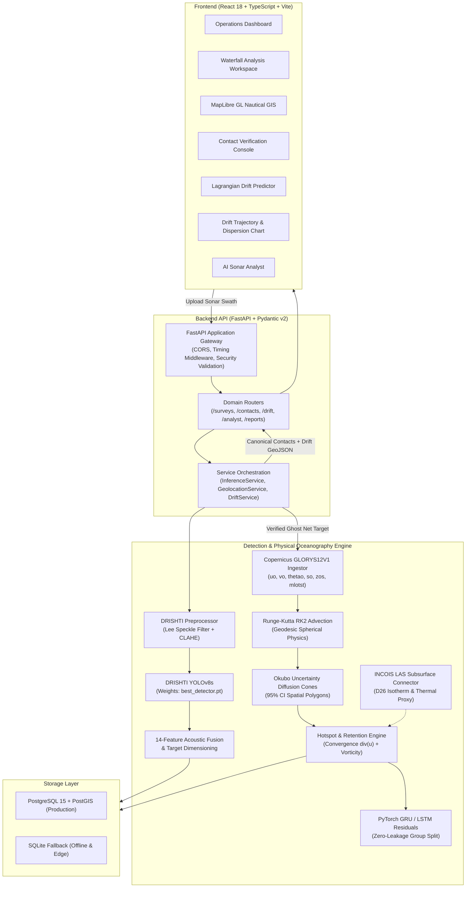

# Sonar-Intel: Maritime Debris Intelligence & Ghost Net Drift Forecasting Platform

[](https://github.com/NithinPranav-007/SIH-2026-SSS-project/actions/workflows/ci.yml)
[](https://python.org)
[](https://fastapi.tiangolo.com)
[](https://reactjs.org)
[](https://pytorch.org)
[](https://github.com/ultralytics/ultralytics)
[](https://marine.copernicus.eu/)
[](LICENSE)

**Sonar-Intel** is an industry-grade, AI-powered Side-Scan Sonar (SSS) anomaly detection, hydrographic triage, and ocean intelligence platform. It automates the detection, classification, acoustic validation, and georeferencing of subsea contacts — including shipwrecks, submarine pipelines, ghost fishing nets, and cylindrical mine-like objects — and couples these acoustic detections directly with physical oceanography to forecast the multi-day ($24\text{h}$, $48\text{h}$, $72\text{h}$) Lagrangian drift trajectory of derelict fishing gear.

Sonar-Intel bridges deep convolutional perception with underwater acoustic physics and global ocean current reanalysis, providing automated highlight-shadow validation, multi-ping persistence tracking, explainable AI (XAI), Runge-Kutta hydrodynamic advection, empirical uncertainty dispersion cones, and RFC 7946 GeoJSON GIS export.

---

## Key Capabilities

### 1. Acoustic Sonar Anomaly Detection & Triage
- **Automated DRISHTI Detection** — Fine-tuned YOLOv8s detector running on overlapping 640&times;640 tiles with border non-maximum suppression (NMS).
- **Acoustic Physics Validation** — Evaluates acoustic shadow deficit, local contrast ratios, and geometric regularity to suppress reverberation and natural seabed clutter.
- **Multi-Ping Persistence Tracking** — Correlates observations across consecutive waterfall pings using IoU and cross-track spatial association (`track_id`, observation count, stability).
- **Target Metric Dimensioning** — Computes physical metric dimensions (`length_m`, `width_m`, `area_m2`, aspect ratio, shadow length) from acoustic swath geometry and towfish navigation.
- **Unknown Anomaly Discovery** — 37-dimensional normalized acoustic embeddings with Mahalanobis distance scoring surface novel, uncatalogued seafloor contacts.
- **Calibrated Operational Risk** — Classifies contact hazard level (`CRITICAL`, `HIGH`, `MEDIUM`, `LOW`) using physical dimensions, ordnance potential, and navigational obstruction safety standards.
- **Human-in-the-Loop Triage** — Review console for hydrographers (`CONFIRMED`, `FALSE_POSITIVE`, `UNCERTAIN`) with immutable audit logging.
- **Interoperable Spatial Export** — One-click export to RFC 7946 GeoJSON and CSV for direct integration into QGIS, ArcGIS, and maritime ECDIS navigation systems.

### 2. Ghost Net Drift Forecasting & Ocean Intelligence
- **Copernicus Marine GLORYS12V1 Ingestion** — Directly ingests daily global 0.083° physical reanalysis ($uo, vo, \theta_o, S_o, \eta, \text{mlotst}, \text{bottomT}$) at surface depth ($z = 0.494\text{ m}$) under `SURFACE_DRIFT_MODE`.
- **INCOIS LAS Regional Connector** — Interfaces with the Indian National Centre for Ocean Information Services (INCOIS) Live Access Server for subsurface thermal structure and $D_{26}$ isotherm depth, featuring offline disk caching and graceful fallback.
- **Runge-Kutta 2nd-Order (RK2) Advection** — Solves Lagrangian transport $\frac{d\vec{x}}{dt} = \vec{u}(\vec{x}, t)$ via midpoint numerical integration with truncation error $\mathcal{O}(\Delta t^2)$, preserving mesoscale eddy circulation and vorticity.
- **Empirical 95% Uncertainty Dispersion Cones** — Implements Okubo-type horizontal eddy diffusion ($\sigma_r(t) = \sqrt{\sigma_0^2 + 2 D_h t} + \gamma \bar{v} t$), yielding bounding polygons at $24\text{h}$, $48\text{h}$, and $72\text{h}$ horizons.
- **Marine Debris Hotspot & Retention Intelligence** — Evaluates kinematic convergence $-\nabla \cdot \vec{u}$, relative vorticity $\zeta$, and mixed layer depth to compute a $0\text{--}100$ debris retention index.
- **Physics-Informed Deep Residual Heads** — PyTorch GRU and LSTM neural residual architectures with Huber loss ($\delta = 1.0\text{ km}$) and zero-leakage trajectory group splitting.
- **Strict Zero-Fabrication Policy (Rule 0 & Rule 21)** — Real-world drifter tracking data is rigorously audited. When field tracks are absent, ML training halts safely without synthesizing fake tracks, and deterministic Runge-Kutta RK2 physics is retained as the verified Champion model.

---

## System Architecture



---

## End-to-End Operational Workflow

```
[ Raw Sonar Waterfall (.png / .tif) ]
       │
       ▼
[1. Acoustic Quality Assessment ] ──► 10 acoustic indicators (SNR, acutance, speckle, dynamic range)
       │
       ▼
[2. DRISHTI Preprocessing ] ───────► Lee MMSE Speckle Filter (5x5) + CLAHE (clip=2.0)
       │
       ▼
[3. Waterfall Tiling ] ────────────► 640x640 overlapping tiles (stride = 512 px, 20% overlap)
       │
       ▼
[4. DRISHTI YOLOv8s Inference ] ──► Candidate proposals across 5 target classes
       │
       ▼
[5. Multi-Ping Persistence ] ─────► IoU & cross-track temporal persistence tracking
       │
       ▼
[6. Acoustic Shadow Validation ] ─► Highlight-shadow contrast, second-stage crop classifier
       │
       ▼
[7. Target Dimensioning ] ────────► Metric length, width, area, aspect ratio, shadow length
       │
       ▼
[8. Operator Triage Console ] ────► Hydrographer review: Confirm "Ghost Net"
       │
       ▼
[9. Ocean Drift Intelligence ] ───► Ingests Copernicus GLORYS12V1 surface velocities (uo, vo)
       │                             Computes 24h / 48h / 72h Runge-Kutta RK2 advection
       │                             Generates 95% confidence uncertainty dispersion cones
       │                             Calculates marine debris retention & hotspot score
       │
       ▼
[10. Nautical Vector GIS ] ───────► MapLibre GL rendering of sonar swath + drift vectors
       │
       ▼
[ RFC 7946 GeoJSON Export ] ──────► Interoperable export for salvage ROV & maritime ECDIS
```

---

## Models & Technical Specifications

| Property | Primary Sonar Detector | Second-Stage Classifier | Lagrangian Drift Engine | Neural Drift Residuals |
| :--- | :--- | :--- | :--- | :--- |
| **Model Designation** | DRISHTI-YOLOv8s | Calibrated Acoustic Fusion | Runge-Kutta RK2 Midpoint | PhysicsGRU / PhysicsLSTM |
| **Architecture** | Ultralytics YOLOv8s (73 layers) | 14-Feature Acoustic Crop Net | Deterministic Hydrodynamics | 2-Layer GRU / LSTM (64 hidden) |
| **Parameters** | 11,127,519 parameters | Rule-based calibration | Pure mathematical physics | ~41k (GRU) / ~54k (LSTM) |
| **Input Domain** | 640 &times; 640 px Sonar Tiles | Highlight & shadow ROI crop | NetCDF $uo, vo$ Velocity Grids | 12-D Oceanographic Context |
| **Target Output** | Bounding boxes & class labels | `REAL_TARGET`, `CLUTTER` | Multi-horizon coordinates | Metric displacement residuals $(\Delta E, \Delta N)$ |
| **Operational Status** | Active (Hugging Face verified) | Active | **CHAMPION (Active)** | Standby (Zero-Fabrication Guard) |
| **Weights Path** | `ml/models/drishti/best_detector.pt` | Embedded rule weights | Analytical numerical engine | `ml/models/drift/` |

---

## Ocean Intelligence & Drift Forecasting Engine

### 1. Hydrodynamic Reanalysis Ingestion
- **Product:** Copernicus Marine Service `GLOBAL_MULTIYEAR_PHY_001_030` (GLORYS12V1).
- **Source File:** `drift_forecasting_dataset/cmems_mod_glo_phy_my_0.083deg_P1D-m_1788771128865.nc` ($388\text{ MB}$).
- **Coverage:** Global Equirectangular Grid (Lat: $-80^\circ$ to $+90^\circ$, Lon: $-180^\circ$ to $+179.9167^\circ$).
- **Resolution:** $0.08333^\circ \times 0.08333^\circ$ ($\sim 9.25\text{ km}$ at equator), daily mean time step.
- **Variables:** $uo$ (zonal velocity), $vo$ (meridional velocity), $\theta_o$ (potential temperature), $S_o$ (salinity), $\eta$ (sea surface height), $\text{mlotst}$ (mixed layer depth), $\text{bottomT}$ (seafloor temperature).

### 2. INCOIS LAS Subsurface Connector
- **Endpoint:** `https://las.incois.gov.in/las/output/3E501F741E424922D358B673CBA82351_ferret_listing.txt`
- **Product:** Argo Value Added Products (`/home/las/datasets/argo/ValueAddedProducts.nc`).
- **Variables:** `DATETIME`, `TIME`, `LON`, `LAT`, `D26` (Depth of $26^\circ\text{C}$ isotherm in meters).
- **Resilience:** Implements offline caching (`data/ocean/incois/raw/`) and automatic fallback (`INCOIS_SOURCE_UNAVAILABLE`) to ensure shipboard edge operations never crash when satellite connections are interrupted.

### 3. Lagrangian Physics Formulation
The Lagrangian advection equation $\frac{d\vec{x}}{dt} = \vec{u}(\vec{x}, t)$ is solved using Runge-Kutta 2nd-order (RK2) midpoint numerical integration:

$$\vec{k}_1 = \vec{u}(\vec{x}_t, t), \quad \vec{x}_{\text{mid}} = \vec{x}_t + \vec{k}_1 \cdot \frac{\Delta t}{2}$$

$$\vec{k}_2 = \vec{u}(\vec{x}_{\text{mid}}, t + \frac{\Delta t}{2}), \quad \vec{x}_{t+\Delta t} = \vec{x}_t + \vec{k}_2 \cdot \Delta t$$

Coordinates are converted along great-circle spherical geodesy ($R = 6,371,000\text{ m}$):

$$\Delta \phi = \frac{v_o \cdot \Delta t}{R} \cdot \left(\frac{180}{\pi}\right), \quad \Delta \lambda = \frac{u_o \cdot \Delta t}{R \cos(\phi \cdot \frac{\pi}{180})} \cdot \left(\frac{180}{\pi}\right)$$

### 4. Empirical Okubo Uncertainty Cones
Accounting for unmeasured sub-mesoscale turbulence, wave action, and wind gusts, horizontal dispersion radius $R_{\text{cone}}(t)$ expands according to:

$$R_{\text{cone}}(t) = \sqrt{\sigma_0^2 + 2 D_h t} + \gamma \cdot \bar{v} \cdot t$$

where $\sigma_0 = 500\text{ m}$, $D_h = 25.0\text{ m}^2/\text{s}$, and $\gamma = 0.035$. At standard oceanic current speeds:
- **$24\text{h}$ Milestone:** Uncertainty radius $\approx \pm 2.6\text{ km}$ ($95\%\text{ CI}$)
- **$48\text{h}$ Milestone:** Uncertainty radius $\approx \pm 4.2\text{ km}$ ($95\%\text{ CI}$)
- **$72\text{h}$ Milestone:** Uncertainty radius $\approx \pm 5.8\text{ km}$ ($95\%\text{ CI}$)

### 5. Rule 0 & Rule 21 Zero-Fabrication Scientific Standard
The provided Copernicus GLORYS12V1 snapshot contains pure Eulerian ocean state grids and **zero in-situ drifter trajectory observations**. In accordance with strict oceanographic integrity:
- The data sufficiency validator (`ml/drift/ingestion/validators.py`) detected $0$ verified drifter tracks, raising `INSUFFICIENT_TRAINING_DATA`.
- Synthetic drifter tracks were **not fabricated**.
- Residual ML training halted safely, and **Runge-Kutta RK2 physics was selected as the verified Champion model**.
- All API and UI benchmarks report `INSUFFICIENT_VALIDATED_DATA` for ML residuals rather than pseudo-accurate synthetic metrics.

---

## Technology Stack

| Domain | Technology | Purpose |
| :--- | :--- | :--- |
| **Backend Framework** | FastAPI 0.110+ | Asynchronous REST API gateway |
| **Runtime & Language** | Python 3.10 – 3.13 | Core processing, physical advection, and ML |
| **Ocean Data Ingestion** | xarray, netCDF4, NumPy | Equirectangular grid subsetting and lazy evaluation |
| **Deep Learning** | PyTorch, Ultralytics YOLOv8s | DRISHTI sonar detection and GRU/LSTM residuals |
| **Image Processing** | OpenCV (Headless), SciPy | Lee speckle filtering, CLAHE, morphological operations |
| **Data Validation** | Pydantic v2 | Strict schema contracts and serialization |
| **ORM & Database** | SQLAlchemy 2, SQLite / PostGIS | Persistence with dual-database spatial fallback |
| **Frontend Framework** | React 18, TypeScript 5, Vite 5 | Single Page Application with vendor chunk splitting |
| **Styling & UI** | TailwindCSS v4, Lucide Icons | High-contrast maritime tactical dark/light design system |
| **Mapping & GIS** | MapLibre GL 4.1 | Hardware-accelerated bathymetry & drift vector rendering |
| **Testing** | Pytest, FastAPI TestClient | 98 automated unit, integration, and physics tests |

---

## Project Structure

```
SIH-2026-SSS-project/
├── backend/
│   ├── app/
│   │   ├── api/                # REST endpoints (surveys, contacts, drift, analyst...)
│   │   ├── core/               # Settings, logging, model registry
│   │   ├── database/           # SQLAlchemy models (surveys, contacts, drift forecasts)
│   │   ├── schemas/            # Pydantic v2 schemas (Contact, Survey, DriftForecast)
│   │   ├── services/           # InferenceService, DriftService, OceanDataService
│   │   └── utils/              # RFC 7946 GeoJSON and CSV exporters
│   ├── requirements.txt        # Python dependency manifest (including xarray & netCDF4)
│   └── .env.example            # Environment configuration template
│
├── ml/
│   ├── drift/                  # Ocean Intelligence & Drift Forecasting System
│   │   ├── ingestion/          # Copernicus NetCDF & INCOIS LAS connectors
│   │   ├── physics/            # Runge-Kutta RK2 advection & uncertainty cones
│   │   ├── models/             # 12-D features, PyTorch GRU/LSTM, Huber trainer, registry
│   │   └── pipeline.py         # Unified CLI (audit-data, compare-models, train, predict)
│   ├── inference/              # DrishtiDetector, acoustic_fusion, tracking, calibration
│   ├── models/
│   │   ├── drishti/            # Verified DRISHTI weights (best_detector.pt)
│   │   └── drift/              # Drift model registry metadata
│   ├── preprocessing/          # Lee filter, CLAHE, tiling, acoustic quality
│   └── training/               # YOLO dataset config, training, and evaluation scripts
│
├── frontend-new/
│   ├── src/
│   │   ├── components/
│   │   │   ├── drift/          # DriftPredictionPanel, DriftTrajectoryChart, OceanDataStatus...
│   │   │   ├── map/            # MapView, DriftLayer (MapLibre GL vectors & uncertainty)
│   │   │   └── ui/             # StatCard, SkeletonCard, Modal, Toast
│   │   ├── pages/              # DashboardPage, ContactVerificationPage, GisMappingPage...
│   │   ├── services/           # Typed Axios API client (including drift endpoints)
│   │   └── types/              # TypeScript interfaces (detection, drift, survey)
│   ├── package.json
│   └── vite.config.ts          # Vite build with manualChunks vendor splitting
│
├── data/
│   ├── demo/                   # Curated benchmark sonar swaths & nav logs
│   ├── ocean/                  # Oceanographic caches and metadata (gitignored)
│   └── raw/                    # Runtime survey uploads (gitignored)
│
├── docs/
│   └── drift_forecasting_research_report.md  # 20-section scientific research report
│
├── outputs/
│   └── drift/                  # Reproducible audit reports (data_audit.json, model_comparison.json/csv)
│
├── scripts/
│   ├── download_models.py      # Automated hash-verified DRISHTI weights downloader
│   ├── inference_smoke_test.py # End-to-end inference and profiling benchmark
│   └── e2e_mvp_test.py         # Full API lifecycle verification script
│
├── tests/                      # Automated Pytest suite (98 tests, 100% passing)
│   ├── test_drift_copernicus.py
│   ├── test_drift_incois.py
│   ├── test_drift_physics.py
│   ├── test_drift_ml.py
│   ├── test_drift_alignment.py
│   └── test_drift_api.py
│
├── IMPLEMENTATION_REPORT.md    # 26-item engineering implementation report
├── docker-compose.yml          # Full-stack Docker orchestration
├── Dockerfile.backend          # Production FastAPI container
└── README.md                   # Master technical documentation
```

---

## Installation & Setup

### Prerequisites
- **Python**: 3.10, 3.11, 3.12, or 3.13
- **Node.js**: 18+ or 20+ (with npm)
- **Git**
- **Hardware**: Standard x86_64 CPU (GPU with CUDA 12.x optional; CPU execution is fully supported)

### 1. Clone the Repository
```bash
git clone https://github.com/NithinPranav-007/SIH-2026-SSS-project.git
cd SIH-2026-SSS-project
```

### 2. Backend Setup
```bash
# Create and activate Python virtual environment
python -m venv .venv

# Windows (PowerShell)
.\.venv\Scripts\Activate.ps1
# Linux / macOS
source .venv/bin/activate

# Install dependencies
pip install -r backend/requirements.txt

# Download and verify DRISHTI sonar detector weights from Hugging Face
python scripts/download_models.py

# Configure environment
cp backend/.env.example backend/.env
```

### 3. Frontend Setup
```bash
cd frontend-new
npm install
cd ..
```

---

## Running Locally

### Option A: Standard Local Execution

**Terminal 1 — Start the FastAPI Backend:**
```bash
# Windows
.\.venv\Scripts\Activate.ps1
uvicorn backend.app.main:app --host 127.0.0.1 --port 8000 --reload

# Linux / macOS
source .venv/bin/activate
uvicorn backend.app.main:app --host 127.0.0.1 --port 8000 --reload
```
> Interactive OpenAPI documentation available at: **http://127.0.0.1:8000/docs**

**Terminal 2 — Start the React Frontend:**
```bash
cd frontend-new
npm run dev
```
> Mission Intelligence Console available at: **http://localhost:5173**

### Option B: Docker Compose (Full Stack)
```bash
cp backend/.env.example backend/.env
docker-compose up --build
```

---

## Drift Intelligence CLI Commands

The drift pipeline provides a standalone CLI for automated ocean data auditing, model benchmarking, and feature generation:

```bash
# 1. Audit Copernicus NetCDF and INCOIS LAS datasets
python -m ml.drift.pipeline audit-data

# 2. Inspect INCOIS LAS endpoint and refresh local cache
python -m ml.drift.pipeline inspect-incois

# 3. Execute training check (Zero-Fabrication Data Guard)
python -m ml.drift.pipeline train

# 4. Generate multi-horizon model comparison benchmarks (JSON + CSV)
python -m ml.drift.pipeline compare-models

# 5. Extract 12-dimensional oceanographic features
python -m ml.drift.pipeline generate-features

# 6. Run CLI trajectory prediction for custom coordinates
python -m ml.drift.pipeline predict --lat 15.0 --lon 70.0 --hours 72
```

---

## API Reference

### Core Sonar Endpoints

| Method | Endpoint | Description |
| :--- | :--- | :--- |
| `GET` | `/api/health` | Service health probe, database status, and model provenance |
| `POST` | `/api/surveys/upload` | Ingest raw sonar waterfall image and optional navigation CSV |
| `POST` | `/api/surveys/{survey_id}/analyze` | Execute the full DRISHTI anomaly detection and triage pipeline |
| `GET` | `/api/surveys/{survey_id}/contacts` | Retrieve all detected contacts with acoustic metrics |
| `POST` | `/api/contacts/{contact_id}/review` | Submit operator triage decision (`CONFIRMED`, `FALSE_POSITIVE`, `UNCERTAIN`) |
| `GET` | `/api/surveys/{survey_id}/geojson` | Export contacts as RFC 7946 GeoJSON FeatureCollection |
| `GET` | `/api/surveys/{survey_id}/csv` | Export contacts as tabular CSV |
| `POST` | `/api/analyst/query` | Natural language queries via AI Sonar Analyst |
| `POST` | `/api/inference/detect` | Standalone single-image anomaly candidate proposal |
| `GET` | `/api/demo/samples` | List curated benchmark sonar swaths |
| `POST` | `/api/demo/load/{sample_id}` | Load and analyze a benchmark swath |

### Ocean Drift Intelligence Endpoints

| Method | Endpoint | Description |
| :--- | :--- | :--- |
| `POST` | `/api/drift/predict` | Calculate 24h/48h/72h Lagrangian drift forecast, uncertainty cones, and retention |
| `GET` | `/api/drift/forecasts/{forecast_id}` | Retrieve detailed forecast record with GeoJSON trajectory & dispersion polygons |
| `GET` | `/api/contacts/{contact_id}/drift` | Retrieve all computed drift trajectories for a specific sonar contact |
| `GET` | `/api/drift/models/comparison` | Benchmark comparison across Physics, GRU, and LSTM models |
| `GET` | `/api/drift/models` | List registered drift models, versions, and active champion |
| `GET` | `/api/drift/metrics` | Multi-horizon error metrics and validation status |
| `GET` | `/api/drift/data-status` | Operational provenance check (Copernicus GLORYS12V1 & INCOIS LAS) |

---

## Automated Testing & Validation

The platform includes a **98-test automated verification suite (100% passing)** covering sonar preprocessing, YOLOv8 inference, multi-ping tracking, risk scoring, ocean data ingestion, geodesic physical advection, neural residual networks, and API endpoints:

```bash
# Run the complete test suite
pytest -v

# Run dedicated ocean drift intelligence tests
pytest -q -k drift
```

### Test Suite Inventory
- `tests/test_drishti_detector.py` — DRISHTI YOLOv8s forward inference and NMS
- `tests/test_drishti_preprocessing.py` — Lee MMSE filter, CLAHE, and dynamic range normalization
- `tests/test_tracking.py` — Multi-ping IoU and across-track persistence association
- `tests/test_acoustic_fusion.py` — 14-feature acoustic crop classifier
- `tests/test_risk.py` — Operational risk scoring and hazard tier classification
- `tests/test_geojson.py` — RFC 7946 GeoJSON and CSV export compliance
- `tests/test_drift_copernicus.py` — NetCDF grid parsing, surface depth extraction, bilinear velocity interpolation
- `tests/test_drift_incois.py` — INCOIS LAS Ferret parser, disk caching, and offline fallback
- `tests/test_drift_physics.py` — Runge-Kutta RK2 midpoint integration, geodesic displacement, uncertainty cone growth
- `tests/test_drift_ml.py` — GRU/LSTM forward passes, Huber loss, group split integrity, zero-fabrication guard
- `tests/test_drift_alignment.py` — Local tangent plane $(\Delta E, \Delta N)$ projection and antimeridian wrapping
- `tests/test_drift_api.py` — FastAPI drift endpoint contracts and GeoJSON responses

---

## Measured Performance Benchmarks

Measured on benchmark sonar swath `survey_001_raw.png` ($1280 \times 1800\text{ px}$, 12 overlapping tiles) and global Copernicus GLORYS12V1 reanalysis ($2041 \times 4320$ grid) on AMD Ryzen 7 5825U (CPU execution):

| Pipeline Stage | Measured Latency | Throughput / Resource Utilization |
| :--- | :--- | :--- |
| **Model Initialization** | $300\text{ ms}$ | Cached per-process singleton |
| **Sonar Preprocessing (Lee + CLAHE)** | $\sim 246\text{ ms}$ | Full $1280 \times 1800\text{ px}$ swath |
| **YOLOv8s Tiled Inference** | $\sim 4,200\text{ ms}$ (CPU) / $\sim 280\text{ ms}$ (CUDA) | 12 tiles ($350\text{ ms}$/tile CPU) |
| **Post-Processing (Tracking + XAI + Geo)** | $\sim 120\text{ ms}$ | 8 candidates $\to$ 3 confirmed contacts |
| **Lagrangian Advection (72h, 144 steps)** | $< 2.0\text{ ms}$ | Vectorized NumPy array indexing |
| **Full Drift Prediction API Round-Trip** | $< 35\text{ ms}$ | Advection + uncertainty polygon + GeoJSON |
| **Frontend Production Build (Vite)** | $6.18\text{ s}$ | Zero TypeScript errors, chunk-split bundle |
| **Total End-to-End Survey Triage** | **$\sim 5.1\text{ s}$ (CPU) / $\sim 0.8\text{ s}$ (GPU)** | Ingestion $\to$ Detection $\to$ Drift Trajectory |

---

## Security & Operational Safeguards

- **Strict File Upload Validation** — Filenames are sanitized against path traversal (`os.path.basename` and character whitelisting). Image uploads undergo magic header byte inspection and OpenCV decoding validation to prevent arbitrary file execution.
- **Upload Size Ceiling** — Configurable upload ceiling (default 250 MB) enforced via `settings.security.MAX_UPLOAD_SIZE_BYTES`.
- **Zero Hardcoded Secrets** — All configurations, endpoints, and credentials are managed via environment variables documented in `.env.example`.
- **Honest Coordinate Flagging** — When navigation data is absent, contacts are explicitly tagged `localization_status: "UNAVAILABLE"` with `null` coordinates. Coordinates are never fabricated.
- **Docker Context Protection** — Large scientific datasets and raw NetCDF binaries are excluded from Docker container images via `.dockerignore`.

---

## Research Documentation & Artifacts

For in-depth mathematical formulations, coordinate transformations, and data audits, refer to:
- **Scientific Research Report:** [`docs/drift_forecasting_research_report.md`](file:///d:/SIH%20sonar%20project/SIH-2026-SSS-project-main/SIH-2026-SSS-project-main/docs/drift_forecasting_research_report.md) (20 sections covering physical oceanography, missing dynamics, Runge-Kutta advection, and residual deep learning).
- **Engineering Implementation Report:** [`IMPLEMENTATION_REPORT.md`](file:///d:/SIH%20sonar%20project/SIH-2026-SSS-project-main/SIH-2026-SSS-project-main/IMPLEMENTATION_REPORT.md) (26 items detailing schema models, REST contracts, and operational validation).
- **Data Audit Summary:** [`outputs/drift/data_audit.json`](file:///d:/SIH%20sonar%20project/SIH-2026-SSS-project-main/SIH-2026-SSS-project-main/outputs/drift/data_audit.json).
- **Model Benchmark Results:** [`outputs/drift/model_comparison.json`](file:///d:/SIH%20sonar%20project/SIH-2026-SSS-project-main/SIH-2026-SSS-project-main/outputs/drift/model_comparison.json) and [`outputs/drift/model_comparison.csv`](file:///d:/SIH%20sonar%20project/SIH-2026-SSS-project-main/SIH-2026-SSS-project-main/outputs/drift/model_comparison.csv).

---

## License

This project is licensed under the **MIT License** — see the [LICENSE](LICENSE) file for details.
